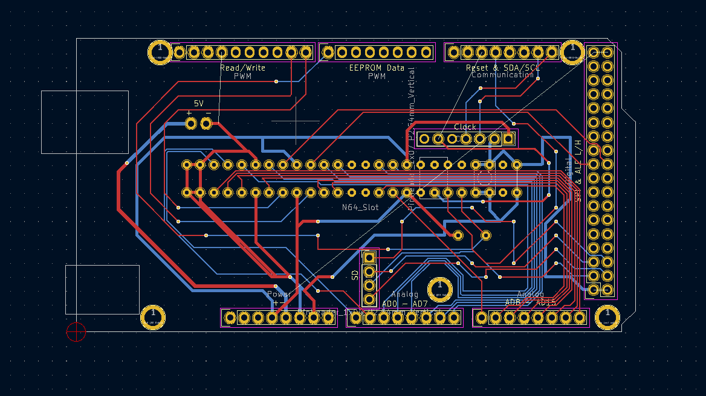
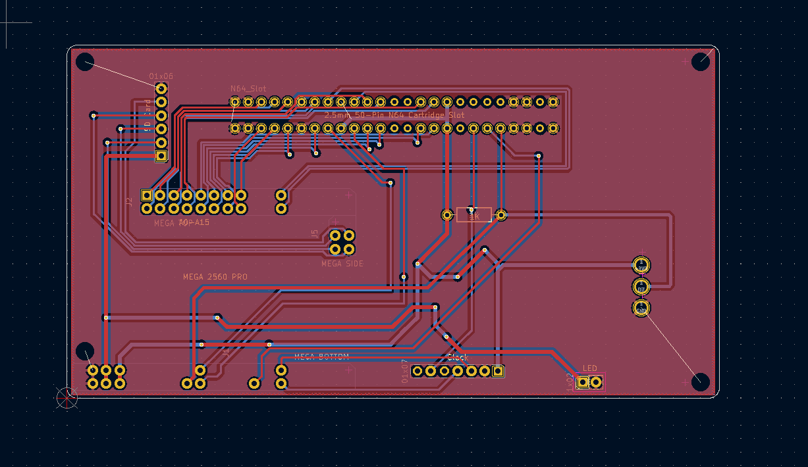
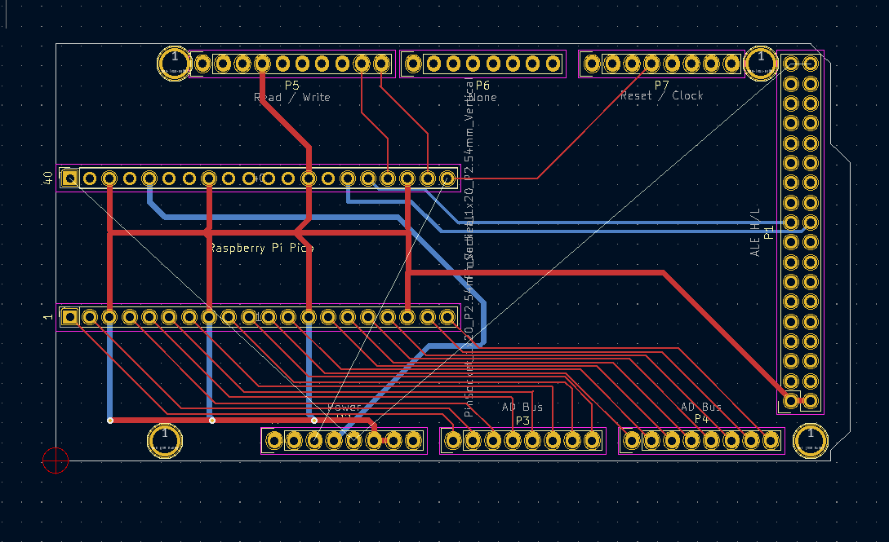

# N64 ROM/Save Dumper

This device allows you to easily back up your Nintendo 64 game ROMs and save files.

This project is a modification of the [sanni Cart Reader](https://github.com/sanni/cartreader).

## Table of Contents
- [Getting Started](#getting-started)
- [Operating the Device](#operating-the-device)
  - [Windows](#windows)
  - [macOS / Linux](#macos--linux)
  - [Android](#android)
- [Troubleshooting](#troubleshooting)
- [Acknowledgements](#acknowledgements)

## Getting Started

Follow these two steps before the first use.

#### 1. What You'll Need
* N64 Cart Reader device
* A microSD Card (4 GB or larger)
* A Micro-USB cable
* A computer or Android device (with USB-OTG adapter)

#### 2. Prepare the microSD Card
A properly configured microSD card is required for operation. The device will display an `SD Error` if the card is missing or not set up correctly.

1.  **Format the Card**: Format your microSD card to FAT32 or exFAT.
2.  **Add Config File**: [Download the `n64.txt` file](https://raw.githubusercontent.com/sanni/cartreader/master/sd/n64.txt) (right-click and "Save Link As...") and place it in the root directory of the card.

## Operating the Device

The device is powered and controlled via a USB serial connection.

### Windows
The recommended tool is **[PuTTY](https://www.putty.org/)**.

1.  **Find COM Port**: Open **Device Manager**, expand **Ports (COM & LPT)**, and find the device (e.g., `COM3`).
2.  **Connect**: In PuTTY, select **Connection type: Serial**, enter your `COM#` in **Serial line**, and set **Speed** to `9600`. Click **Open**.

### macOS / Linux
The recommended tool is the built-in `screen` command.

1.  **Find Device Name**: Connect the device and run `ls /dev/tty.*` in a terminal to find the device name (e.g., `/dev/tty.usbmodem14101` or `/dev/ttyACM0`).
2.  **Connect**: In the terminal, run `screen /dev/<your-device-name> 9600`.

### Android
The recommended app is **[Serial USB Terminal](https://play.google.com/store/apps/details?id=de.kai_morich.serial_usb_terminal)**, used with a USB-OTG adapter. The app will auto-detect the device upon connection.

## Troubleshooting

#### Cartridge Read Errors
If the game title appears garbled or you get a `Gamepak Error`, the cartridge is not being read correctly. Like an original N64, a poor connection is the most common cause.

* **Solution**: Remove the cartridge and clean the contacts with a q-tip and isopropyl alcohol. Reseat the cartridge firmly in the slot and try again.

_Example of a bad read. The title should say 'TONYHAWKPROSKAT'._

#### "Clock generator not found..." Message
You may occasionally see this message. It is a known software quirk. Simply select the `Game Cartridge` option again and it will proceed normally.

## Hardware Overview

The hardware for this project has evolved into three distinct components that can be combined to create different configurations. This allows for flexibility and modularity in both use and development.

*(Suggestion: Add a high-quality photo here showing the three main physical boards: The Shield, the Single-Board Reader, and the Shield Adapter.)*

---

### Shield

_Shield PCB_
* **Status:** `Stable / Mature`
* **Description:** A "Shield" PCB designed with the standard Arduino Mega 2560 footprint. It contains the N64 cartridge slot and all necessary interface hardware.
* **Key Features:**
    * N64 Cartridge Slot
    * SD Card and Real-Time Clock (RTC) modules.
    * Optional connections for N64 Controller.
* **Issues:**
    * Requires desoldering the barrel-jack and ICSP headers from the Arduino Mega, which is a pain in the ass.
* **How to Use:** This Shield can be used in two main ways:
    1.  **Directly with an Arduino Mega 2560:** The original, stable configuration.
    2.  **With a Raspberry Pi Pico:** By using the **Shield Adapter for Pico** (see Component 3).
* **Files:** See `hardware/shield/`

---

### Single-Board Reader

_Single-Board Reader PCB_
* **Status:** `Mature (ATmega2560)` and `Future (RP2040)`
* **Description:** An all-in-one device integrating all components from the **Shield** and a microcontroller onto a single PCB.
* **Versions:**
    * **`Stable` ATmega2560 Version:** This version uses an ATmega2560 "embed" module and features a surface-mount N64 controller port.  
    (Files: `hardware/board/mega2560_stable/`)

    * **`Future` RP2040 Version:** A new board designed from the ground up with the RP2040.
        * **Planned Features:** Buzzer for alerts and Easter egg tunes, status/busy LEDs, hardware configuration switches (e.g., for mute or different USB modes) 
        (Files: `hardware/board/rp2040_future/`)

---

### Shield Adapter for Pico

_Adapter PCB_
* **Status:** `Active Development`
* **Description:** A bridge accessory, allowing the Raspberry Pi Pico to connect to the **Shield**.
* **Key Features:**
    * A socket for a Raspberry Pi Pico.
    * Exact footprint of an Arduino Mega 2560.
* **How to Use:** Solder a Pico to this adapter, then plug the adapter into the **Shield**.
* **Files:** See `hardware/adapter/`

---

## Acknowledgements
* This project is built upon the incredible work of **sanni**, who created and maintains the original [sanni Cart Reader](https://github.com/sanni/cartreader).